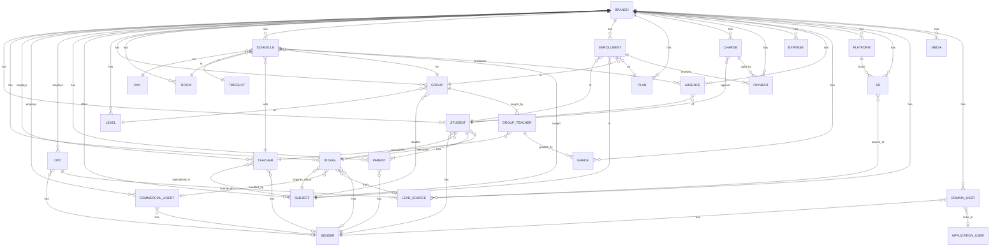

# School Management System — Onboarding Guide

## One-paragraph summary

This is a **school management web application** that helps a school (or multiple branches of a school) manage the full student lifecycle: from when someone first inquires about classes (a "Lead/Intake"), through becoming a registered student, joining classes (Groups and Schedules), getting evaluated (Grades), and handling all the money involved (Plans, Enrollments, Payments, Charges, Expenses). The backend is an ASP.NET Core API with SQL Server + Entity Framework Core, and the frontend is React with TypeScript and Tailwind. It follows a layered architecture (API → Application → Domain → Infrastructure) so concerns are cleanly separated.

---

## Core entities

Think of these as the main "things" in the system — each maps to a database table.

| Entity | What it is, in plain English |
|---|---|
| **Branch** | A physical school location (e.g. "Downtown Campus"). Almost every other record belongs to a Branch. |
| **LeadSource** | Where a lead/intake came from. Two subtypes: **AdLeadSource** (from an advertisement on a Platform) and **OpcLeadSource** (from an OPC staff member who handled outreach). |
| **Platform** | A service where ads run (e.g. Facebook, Google, Instagram). |
| **Ad** | A specific advertisement running on a Platform. |
| **Intake** | A person who has inquired about enrollment but isn't a student yet — a "lead". Has a status like New, Contacted, Interested, Enrolled, Not Interested. Assigned to a CommercialAgent and/or a LeadSource. |
| **CommercialAgent** | A staff member responsible for following up with Intakes and closing enrollments. |
| **OPC** | "Orientation & Placement Coordinator" — another type of outreach staff member, generates leads directly. |
| **Student** | A person who has been formally enrolled. Can come from an Intake or can register directly. Has a DateOfBirth, contact info, and belongs to a Branch. |
| **Parent** | A parent or guardian. Can be linked to multiple Students (e.g. a parent with two kids in the school). |
| **Subject** | A course or class subject (e.g. "Mathematics", "English", "Biology"). |
| **Level** | A grade / educational level within a Branch (e.g. "Grade 1", "Level 3"). |
| **Group** | A class group: a set of Students taking the same Subject at the same Level in the same Period (Morning / Afternoon / Evening / Weekend). Has a Capacity. |
| **GroupTeacher** | A link between a Group and its assigned Teacher(s). |
| **Teacher** | A teaching staff member. Has a Specialization (e.g. "Math teacher") and can be assigned to Subjects and Groups. |
| **Schedule** | A specific recurring time slot for a class: which Day + TimeSlot + Room + Teacher + Group + Subject will meet. |
| **Day** | A day of the week used in scheduling (e.g. Monday, Tuesday). |
| **TimeSlot** | A time block used in scheduling (e.g. 9:00–10:30). |
| **Room** | A physical classroom with a Capacity and Floor. |
| **Enrollment** | The record that ties a Student to a specific Subject, Group, and Plan at a Branch. This is the central "student is taking this class" record. Has a Status (Active / Dropped / Completed). |
| **Plan** | A pricing / payment plan for enrollment (e.g. "Full-year", "Semester"). Includes a BaseAmount, an optional DiscountPercent, and how many days the remaining balance is due. |
| **Charge** | An amount owed by a Student (e.g. enrollment fee, books, late payment). Can be linked to a specific source (like an Enrollment). Has a Status (Unpaid, PartiallyPaid, Paid, Cancelled). |
| **Payment** | Money actually paid by a Student. Always linked to an Enrollment and optionally to a Charge. Includes TransferFees, PaymentMethod, and who received the payment (ReceivedByStaffId). |
| **Expense** | Money the school spends (e.g. rent, supplies). Has a Category, Status, Payee, PaymentMethod. |
| **Absence** | A record that a specific Student was absent or late on a specific Schedule date. Can be justified with a Reason. |
| **Grade** | A score/evaluation a Student received for something (e.g. an exam, homework). Linked to a Student and the GroupTeacher who graded it. |
| **Media** | Any uploaded file or asset: student photo, teacher avatar, document, banner. Tracks Owner (Student/Teacher/DomainUser/Branch), file size, dimensions, etc. |
| **Gender** | A simple lookup (Male / Female / …). |
| **DomainUser** | A DDD domain-layer user account (separate from the ASP.NET Identity login). Stores first/last name, active status, and links to the ApplicationUser via ApplicationUserId. |
| **ApplicationUser** | ASP.NET Core Identity user — this is the actual login credential (username/password, email, lockout, etc.). Lives with ASP.NET Identity tables (AspNetUsers, AspNetRoles, etc.). |
| **AuditLog** | A history record showing which entity was changed, by whom, and what the old/new values were. |

---

## Relationships — in plain sentences

- **A Branch has many:** Students, Teachers, Intakes, Enrollments, Charges, Payments, Expenses, Groups, Levels, Rooms, Schedules, Ads, Platforms, LeadSources, Medias, Absences, Grades, AuditLogs. Almost everything in the system belongs to one Branch.
- **A LeadSource belongs to one Branch.** An AdLeadSource also references one Ad; an OpcLeadSource also references one OPC.
- **An Ad runs on one Platform and belongs to one Branch.** A Platform can host many Ads.
- **An Intake belongs to one Branch and one Subject.** It optionally refers to: one CommercialAgent (the staff following up), one LeadSource (where the lead came from), and one Gender. An Intake can produce one or more Students.
- **A CommercialAgent can handle many Intakes.** An OPC can generate many LeadSources (which lead to Intakes). CommercialAgent and OPC are both types of Employee, who in turn is a type of Person.
- **A Student belongs to one Branch, optionally comes from one Intake, and has one Gender.** A Student can be linked to many Parents; a Parent can have many Students (many-to-many).
- **A Parent belongs to one Branch and optionally has one Gender.**
- **A Subject belongs to one Branch** and can be studied by many Students (via Enrollments) and taught by many Teachers.
- **A Level belongs to one Branch** and groups many Groups.
- **A Group belongs to one Branch, one Level, and one Subject.** A Group has one Schedule (its timetable). A Group can be taught by many Teachers (via GroupTeacher join records).
- **A GroupTeacher connects one Group to one Teacher.** A Grade also links to a GroupTeacher (so you know who gave the grade).
- **A Teacher belongs to one Branch, optionally has one Gender, and optionally has a primary Subject.** A Teacher teaches many Groups (via GroupTeacher) and runs many Schedules.
- **A Schedule belongs to one Branch** and ties together one Day, one TimeSlot, one Room, one Teacher, one Group, and one Subject.
- **Day, TimeSlot, and Room each belong to one Branch** and appear in many Schedules.
- **An Enrollment is the hub: it belongs to one Student, one Subject, one Group, one Plan, and one Branch.** An Enrollment has many Payments.
- **A Plan belongs to one Branch** and is used by many Enrollments.
- **A Charge belongs to one Student and one Branch** (optionally to a source like an Enrollment). A Charge can receive many Payments (a Charge can be paid off in installments).
- **A Payment belongs to one Enrollment and one Branch, and optionally to one Charge.** A Payment also records who received it (ReceivedByStaffId, a DomainUser ID).
- **An Expense belongs to one Branch.** It records who requested/approved it (by Guid, referencing a DomainUser).
- **An Absence belongs to one Student, one Schedule, and one Branch.**
- **A Grade belongs to one Student, one GroupTeacher, and one Branch.**
- **A Media asset belongs to one Branch** and to one Owner (a Student, Teacher, DomainUser, or Branch, tracked by OwnerType + OwnerId).
- **A DomainUser is a type of Person (Person → DomainUser).** It optionally links to one ApplicationUser via ApplicationUserId (the Identity login).
- **AuditLogs track changes across any entity in any Branch.**

---

## Diagram (Mermaid)

> **Tip:** If the diagram doesn't render, paste the block above into the Mermaid Live Editor at https://mermaid.live.

---

## Key concepts / vocabulary

| Term | What it means here |
|---|---|
| **DDD** | Domain-Driven Design. The code is organized around business "things" (entities like Student, Enrollment) rather than database tables. Most entities inherit from `AggregateRoot` or `BaseEntity`. |
| **AggregateRoot** | An entity that is the "entry point" for a cluster of related objects. Repositories only work with AggregateRoots (you don't save a Charge through a Student; you save it directly). |
| **Value Object** | An object that has no ID and is defined by its values, e.g. `Email`, `Address`. These get flattened into the owning entity's table. |
| **TPC mapping** | Table-per-Class. The `Person` hierarchy (Person → Employee → Teacher / CommercialAgent / OPC, and Person → Student / Parent / DomainUser) uses TPC: each concrete type gets its own database table with all its inherited columns. |
| **TPH mapping** | Table-per-Hierarchy. The `LeadSource` hierarchy uses TPH: AdLeadSource and OpcLeadSource both live in the `LeadSources` table, distinguished by a `LeadSourceType` discriminator column. |
| **Soft delete** | Entities aren't actually deleted from the DB; instead a `DeletedAt` timestamp is set. The query filter on `Person` ensures deleted people are hidden by default. Seeders and factories typically skip this kind of filter manually. |
| **Slug** | A URL-friendly string derived from a name (e.g. "John Smith" → "john-smith"). Used for readable URLs and uniqueness checks. Generated with `CustomSluger` / the Slugify library in factories. |
| **Period** (on Group) | A time-of-day bucket the group runs in: Morning / Afternoon / Evening / Weekend. |
| **IsIndependent** (on Intake) | True if the intake walked in directly without being linked to a LeadSource. |
| **IsDirectRegistration** (on Student) | True if the student was registered directly (not through an Intake). An Intake has a Students collection; a Student optionally has an Intake backlink. |
| **LeadSource (type Ad vs OPC)** | Two different ways to get a lead: either from a paid advertisement on a Platform (AdLeadSource → Ad → Platform), or organically generated by an in-house OPC staff member (OpcLeadSource → OPC). |
| **Charge vs Payment** | A **Charge** is what is *owed* (an invoice). A **Payment** is money that actually *arrived*. One Charge can be paid off with multiple Payments. Both Charges and Payments link to students/enrollments differently. |
| **Plan** | Defines *how much* an enrollment costs and the payment terms (BaseAmount, optional DiscountPercent, and RemainingAmountDueDays for when the balance is due). |
| **Enrollment statuses** | Active / Dropped / Completed — tells you whether a student is currently attending, has withdrawn, or has finished the class. |
| **Command (Application layer)** | A DTO that sits between the API Request DTO and the Domain entity. Controllers map Request → Command; services enrich the Command with BranchId (from `ICurrentUserContext`) and generated Slugs; then mappers turn the Command into a domain object. |
| **ICurrentUserContext** | A service that tells you which BranchId the currently-logged-in user belongs to. Services use this to automatically fill in BranchId rather than trusting the client request. |
| **ApplicationUser vs DomainUser** | Two separate concepts on purpose. **ApplicationUser** is ASP.NET Identity's login (stored in `AspNetUsers`, has password hash, email, roles, JWT claims). **DomainUser** is the DDD entity (a Person with first/last name, active status). They are linked via `DomainUser.ApplicationUserId`. |
| **Branch-scoped data** | A deliberate design: almost every entity has a required `BranchId`. Queries and saves should always be filtered or written with the current user's BranchId in mind — don't accidentally leak cross-branch data. |
| **FluentValidators** | Input validation lives in the Application project (e.g. `StudentValidator`, `EnrollmentValidator`). Domain-level rules (like non-empty names) live as guard clauses inside entity factory methods. |
| **CQRS-lite (MediatR + Query Services)** | Commands (writes) flow through MediatR / service classes; reads flow through dedicated Query Services (e.g. `IStudentQueryService`) that typically project directly to Response DTOs. |
